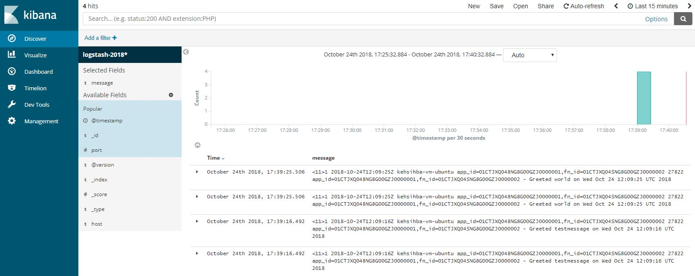

## Fn function logs to ELK

Fn allows you to push [function logs to a syslog endpoint](https://github.com/fnproject/docs/blob/master/fn/operate/logging.md#remote-syslog-for-functions). This is an example of how to configure it and test it using `ELK` stack (`Elasticsearch-Logstash-Kibana`)

ELK stack has been run on Docker using [docker-elk](https://github.com/deviantony/docker-elk) with some changes

- `docker-compose.yml` has been changed to version 3 and removed things like volumes etc. which are not needed for this example
- minor update to `logstash.conf` (inside `logstash/pipeline`) to configure `stdout` format

> `logstash.conf` configuration defines the endpoint for the logstash `syslog` input plugin

## Pre-requisite

- Ensure latest FN CLI. To update - `curl -LSs https://raw.githubusercontent.com/fnproject/cli/master/install | sh`
- Ensure latest Fn server - to update `fn update sv`

## To start off...

Clone or download this repo

> we simply start the Fn server and the ELK stack locally using Docker

- start Fn server - `fn start`
- Switch context - `fn use context default`
- `cd fn-elk/docker-elk && docker-compose up` ... wait for the stack to start up
- Create an application pointing to the logstash `syslog` endpoint - `fn create app fn-elk-app --syslog-url tcp://localhost:5000`

> use the appropriate value for the endpoint if your ELK stack is running elsewhere

## Deploy and test....

- Deploy `cd fn-elk/log-test-sample && fn -v deploy --app fn-elk-app --local`
- Invoke `echo -n 'testmessage' | fn invoke fn-elk-app test` (repeat as needed)

## Check Kibana

Open the Kibana console - `http://localhost:5601`, head over the **Discover** section, add **message** to the **Selected Fields** and you should be able to see the functions logs

 
